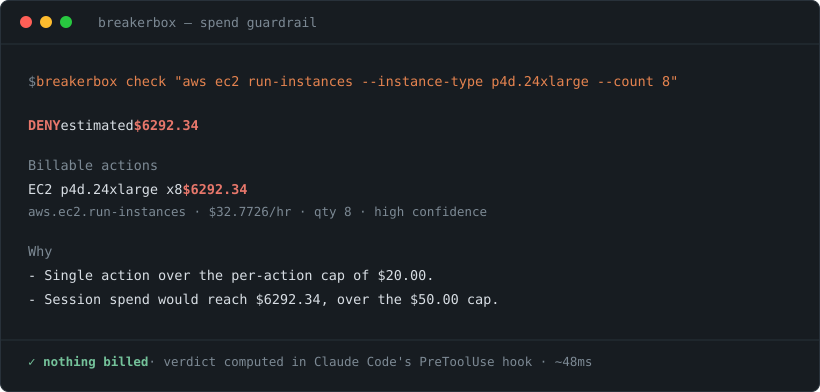

# breakerbox

[](https://www.npmjs.com/package/breakerbox)
[](https://www.npmjs.com/package/breakerbox)
[](https://github.com/ShopDevX/breakerbox/actions/workflows/ci.yml)
[](LICENSE)


**Hard spend caps and a kill-switch for the non-LLM actions your AI agent takes.**

Your LLM gateway meters tokens. It does not see the `aws ec2 run-instances` your
agent just ran.

breakerbox sits in Claude Code's `PreToolUse` hook, reads every Bash command
*before* it executes, estimates what it will cost, and blocks it if that breaches
a cap you set. No proxy, no daemon, no credentials, no account.



```
$ breakerbox check "aws ec2 run-instances --instance-type p4d.24xlarge --count 8"

DENY  estimated $6292.34

Billable actions
  EC2 p4d.24xlarge x8  $6292.34
  aws.ec2.run-instances · $32.7726/hr · qty 8 · high confidence

Why
  - Single action estimated at $6292.34, over the per-action cap of $20.00.
  - Session spend would reach $6292.34, over the session cap of $50.00.
```

---

## Why this exists

The well-documented agent-runaway incidents share a shape: the money was **not**
burned on tokens. An agent looped, spun up EC2 instances and CloudFormation
stacks on its own, and left its operator with a ~$6,500 bill. Every dollar of
that was invisible to an LLM gateway, because not one of those calls was a model
call.

Existing tools cover the model call. LiteLLM, Portkey, Bifrost and friends do
session budgets, iteration caps and alert→throttle→kill on token spend, and they
do it well. Cloud-native budgets (AWS Budgets, billing alarms) are *reactive* —
they tell you hours later, once the money is gone.

Nothing was watching the gap in between: the shell command, the cloud SDK call,
the `terraform apply`. That gap is what breakerbox covers.

> **breakerbox is not a LiteLLM competitor.** Run both. LiteLLM caps what your
> agent spends on tokens; breakerbox caps what it spends on everything else.

---

## Install

```bash
npm i -g breakerbox
breakerbox init
```

`init` writes `breakerbox.config.json`, creates `.breakerbox/`, and registers two
hooks in `.claude/settings.json`. Restart Claude Code and it's live.

```bash
breakerbox doctor    # verifies the whole chain, including a real block
```

`doctor` doesn't just check that files exist — it feeds a synthetic 8×`p4d.24xlarge`
launch through the actually-registered hook command and asserts it comes back denied.

<details>
<summary>Why <code>npm i -g</code> rather than <code>npx</code></summary>

The hook runs on **every** Bash tool call, so startup cost is paid constantly.
breakerbox has zero runtime dependencies and no build step for this reason —
a hook evaluation is ~48ms median on a warm machine, essentially all of it Node
process start. Routing that through `npx` each time would multiply it, and npm
prunes the `_npx` cache out from under the registered path. `init` warns you if
it detects it's running from there.
</details>

---

## What it catches

| Shape | Example | Result |
|---|---|---|
| Oversized resource | `aws ec2 run-instances --instance-type p4d.24xlarge --count 8` | **deny** — $6,292 > per-action cap |
| Runaway loop | `while true; do aws ec2 run-instances ...; done` | **deny** — billable action in an unbounded loop |
| Accumulated drift | 30 small launches across one session | **deny** once the session cap is reached |
| Burst velocity | 12 billable actions in 60s | **deny** — that's a loop, not deliberate work |
| Opaque blast radius | `terraform apply -auto-approve` | **ask** — cost lives in files, not the command |
| Unattended opaque action | same, in `bypassPermissions` mode | **deny** — an "ask" nobody can answer isn't a guardrail |
| Hidden in substitution | `ID=$(aws ec2 run-instances ...)` | **deny** — substitutions are parsed too |
| Ordinary work | `npm test && git commit -am wip` | **allow**, silently |

Covered today: AWS (EC2, RDS, EKS, SageMaker, Redshift, ElastiCache, OpenSearch,
MSK, CloudFormation, ASG, NAT/ALB/TGW, IAM/Organizations), GCP (Compute, GKE,
Cloud SQL, Dataproc, Cloud Run, Deployment Manager), Azure (VM, VMSS, AKS,
managed DB, ARM/Bicep), IaC (Terraform, OpenTofu, Pulumi, CDK, SAM, Serverless,
Helm), plus metered HTTP APIs and rented-GPU CLIs.

---

## How the cost model works

Two numbers per action: `oneTime` and `hourly`.

This matters more than it sounds. **Launching an EC2 instance costs $0 at the
moment you launch it** — the bill arrives over the following hours. A guardrail
that only counted immediate cost would never fire on the exact command that
caused the incident. So breakerbox projects `hourly` over a **horizon** (default
24h) and charges that against your cap up front:

```
charged = (oneTime + hourly × horizonHours) × quantity × loopIterations
```

Unknown instance types resolve to a deliberately **pessimistic** rate and report
low confidence — a guardrail that guesses low is worse than no guardrail. GPU
families are detected by name and default higher still.

For `terraform apply` and `cloudformation create-stack`, breakerbox refuses to
invent a number at all. The cost is defined by files it isn't reading, so it
reports `unknownBlastRadius` and escalates instead of pretending to price it.

---

## Ledger: decide on Pre, charge on Post

`PreToolUse` writes a *pending intent*. `PostToolUse` promotes it to a committed
charge. Nothing counts against your caps until the tool has actually run.

Without this split, a command you denied — or the user cancelled at the
permission prompt — would still eat the session cap, and a few blocked commands
could lock out an agent that never spent a cent.

---

## Configuration

`breakerbox.config.json` in your project root:

```jsonc
{
  "caps": {
    "action":  20,    // any single command line
    "session": 50,    // one agent session
    "daily":   200    // per UTC day
  },
  "rateLimit": { "actions": 12, "windowSeconds": 60 },

  "horizonHours": 24,             // hours of runtime charged up front
  "unboundedLoopAssumption": 25,  // iterations assumed for `while true`

  "onBreach": "deny",                  // deny | ask
  "onUnknownBlastRadius": "ask",       // terraform apply, CFN stacks
  "onUnboundedLoop": "deny",
  "unattendedEscalation": "deny",      // ask -> this, in bypassPermissions
  "unmatched": "allow",                // commands with no rule

  "allow": ["aws s3 ls"],              // substring or /regex/
  "deny":  ["/aws\\s+organizations/"],
  "ignoreRules": ["aws.s3.transfer"],
  "priceOverrides": { "aws.ec2.run-instances": { "hourly": 0.2 } },

  "failMode": "open"                   // open | closed
}
```

Env overrides: `BREAKERBOX_SESSION_CAP`, `BREAKERBOX_DAILY_CAP`,
`BREAKERBOX_DISABLE=1`, `BREAKERBOX_CONFIG`, `BREAKERBOX_DIR`.

### Commands

```bash
breakerbox check "<command>"   # dry-run the policy engine, explain the verdict
breakerbox status              # spend against every cap, with meters
breakerbox log -n 20           # recent committed actions
breakerbox reset --session     # clear a session's spend (--day, --all)
breakerbox doctor              # verify the install end to end
```

---

## What this cannot see

Read this part. A guardrail that oversells itself is worse than none, because you
stop watching.

- **It is a spend guardrail, not a security sandbox.** It reads the command line.
  `eval "$(echo YXdzIGVjMi4uLg== | base64 -d)"`, a cost-incurring action inside a
  shell script it invokes, or a Python SDK call inside `python deploy.py` are all
  invisible to it. It defends against *runaway agents*, not against an adversary
  deliberately evading it.
- **Prices are approximate list prices** (`src/catalog/prices.js`, stamped
  `2026-08`). No region adjustment, no reserved instances, no savings plans, no
  spot, no committed-use discounts, no data transfer or storage. They exist to
  make caps trip at roughly the right time, not to reconcile your invoice.
- **Only `Bash` is inspected today.** MCP tool calls and other tools pass through.
- **`failMode` defaults to `open`.** If breakerbox itself errors, the command
  proceeds and the error lands in `.breakerbox/errors.log`. A bug in this tool
  should not brick your agent. Set `"failMode": "closed"` to invert that.
- **`allow` is expressed as silence.** breakerbox never emits
  `permissionDecision: "allow"`, because that would bypass Claude Code's own
  permission checks and auto-approve commands it merely had no opinion about.
  It only ever speaks up to `deny` or `ask`.
- **Hourly resources are charged once, at launch.** breakerbox does not track
  whether you later terminated the instance. The 24h horizon is a heuristic for
  "is this worth stopping", not an accrual system.

---

## Roadmap

- MCP tool-call interception (`mcp__*` matchers)
- A `PreToolUse` matcher for `Write`/`Edit` on IaC files, to catch spend at
  authoring time rather than apply time
- Framework adapters beyond Claude Code (LangGraph, CrewAI) via a generic
  subprocess wrapper
- `terraform plan` output parsing, to replace `unknownBlastRadius` with a real number

---

## Development

```bash
npm test     # 67 tests, node:test, no dependencies
```

MIT © ShopDevX
